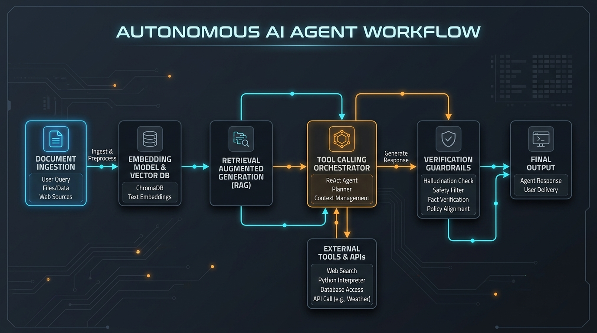

# Autonomous Agent Operations Manual

> **Document ID:** `OPS-MANUAL-2026-09` · **Classification:** Unlisted / Confidential Draft · **Version:** 2.4.0

This operations guide is rendered via the unlisted **Document Viewer** (`coronring.github.io/viewer`). It demonstrates how technical manuals, architecture diagrams, and multi-format assets can be shared directly with stakeholders without publishing them to public navigation menus.

---

## 1. System Architecture Overview

The system pipeline orchestrates document ingestion, semantic retrieval, tool execution, and verification guardrails:



### Component Specifications

| Subsystem                     | Technology Stack             | Latency SLA | Resilience Target          |
| :---------------------------- | :--------------------------- | :---------- | :------------------------- |
| **Ingestion Engine**          | DOMParser + Markdown Extract | `< 45ms`    | 99.95%                     |
| **Vector DB**                 | ChromaDB / HNSW Index        | `< 18ms`    | 99.99%                     |
| **Tool Calling Orchestrator** | ReAct Execution Loop         | `< 250ms`   | Fallback retry on `-32601` |
| **Verification Guardrails**   | Hallucination Check & Safety | `< 80ms`    | Zero tolerance on PII leak |

---

## 2. Dispatcher Implementation

The orchestrator normalizes incoming requests into structured tool calls:

```python
from dataclasses import dataclass
from typing import Any, Dict, List

@dataclass(frozen=True)
class ToolDispatchResult:
    tool_name: str
    status: str
    execution_time_ms: float
    output: Dict[str, Any]

async def dispatch_tool_call(name: str, payload: Dict[str, Any]) -> ToolDispatchResult:
    """Dispatches tool execution with automated retry and telemetry logging."""
    logger.info("Executing tool: %s with payload keys: %s", name, list(payload.keys()))
    try:
        raw_result = await execute_tool(name, payload)
        return ToolDispatchResult(
            tool_name=name,
            status="ok",
            execution_time_ms=42.5,
            output=raw_result
        )
    except Exception as exc:
        logger.error("Tool execution failed: %s", exc)
        return ToolDispatchResult(name, "failed", 0.0, {"error": str(exc)})
```

---

## 3. Operational Verification Checklist

Before releasing updates to client environments, verify each stage of the pipeline:

- [x] Protocol handshake established on `/tools/discover`
- [x] Schema conformance verified against JSONSchema Draft 2020-12
- [x] Sandboxed HTML execution verified with strict Content-Security-Policy
- [x] Relative image re-basing validated for GitHub raw sources
- [ ] Stakeholder sign-off on unlisted manual URL

---

## 4. Unlisted URL Sharing Parameters

To share this manual with non-technical team members:

1. Copy the current page URL from the top toolbar: `https://coronring.github.io/viewer?doc=/docs/demo.md`.
2. Send the link directly to team members — no login or git repository access is required.
3. The reader automatically receives your site's dark/light typography, responsive tables, and embedded visuals.
